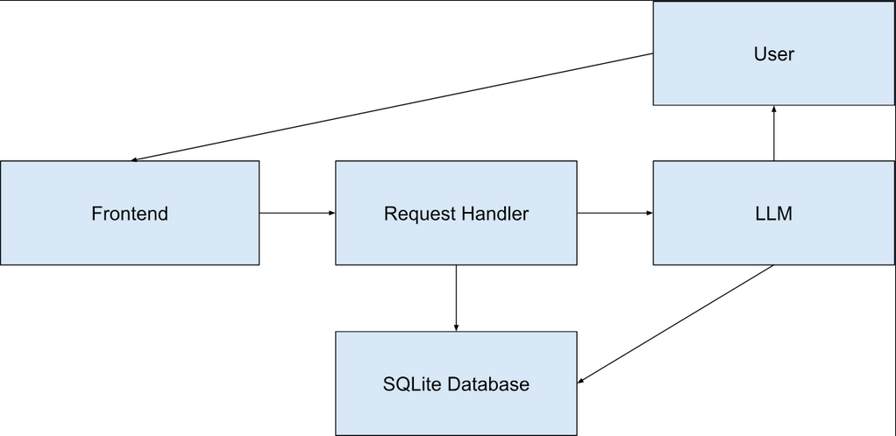

# Recipe TikTok Scrolling App


## Introduction

**Web Application for people who cook**

**Three Main Features:**

    - We store user ingredient data
    
    - We generate new recipes based on available ingredients. If a user requests a particular style recipe, we can handle this as well.
    
    - We present recipes to users in the form of an “endless” TikTok style scroll loop.


## Technical Architecture



**Key Components:**

    - Frontend: React + TypeScript interface for input and display
    
    - Request Handler: Flask API that manages all routing, parsing, and validation
    
    - LLM: Returns structured JSON based on pantry ingredients
    
    - Database: SQLite with normalized tables for pantry, recipes, ingredients, and relationships


## Installation Instructions

### 1. Backend Setup

### Placeholder for rest of backend set up

Ensure that a .env file is set up:
```
ARLIAI_API_KEY=your_actual_api_key
```

Windows
```
pip install -r .\flask_backend\requirements.txt
flask --app .\flask_backend\src\app.py run
```

Mac/Linux
```
pip install -r flask_backend/requirements.txt
flask --app flask_backend/src/app.py run
```

### 2. Frontend Setup

```
cd react_frontend
npm install
npm start
```     
Then open http://localhost:3000 in your browser.

## Developers

- **Rohit (rohit7)**

- **[Chris (zychan2)]** 

- **[Sam (sjs17)]**
